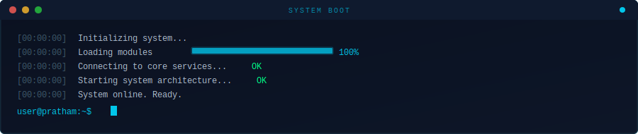
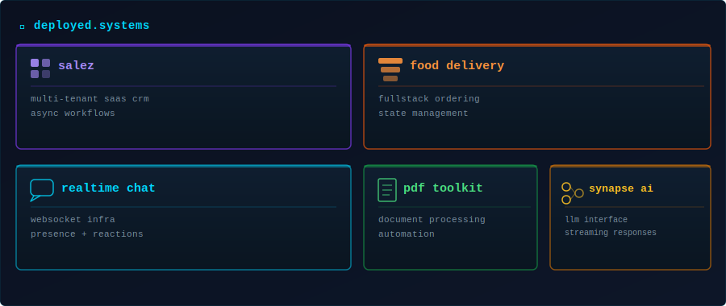
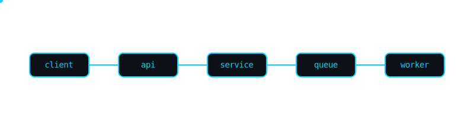
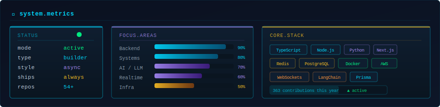

<div align="center">



</div>

<br/>

<div align="center">

# Pratham Sharma

**Building Systems &nbsp;•&nbsp; Fullstack &nbsp;•&nbsp; AI**

</div>

<br/>

<div align="center">

</div>

<br/>

<table>
<tr>
<td width="50%" valign="top">

### ⚙️ &nbsp;`system.profile`

```yaml
status   : building real systems
focus    : scalable apps + real-time + ai
stack    : fullstack development
location : india
uptime   : always shipping
```

</td>
<td width="50%" valign="top">

### ⚡ &nbsp;`core.principles`

```bash
> systems fail    -> design for failure
> latency matters -> optimize early
> scale is planned -> not patched
> async by default -> reduce blocking
```

</td>
</tr>
</table>

<br/>

<div align="center">

</div>

<br/>

<div align="center">

</div>

<br/>

<div align="center">



</div>

<br/>

### 📊 &nbsp;`github.stats`

<div align="center">


&nbsp;


</div>

<br/>

<div align="center">


</div>

<br/>

### 📈 &nbsp;`contribution.graph`

<div align="center">


</div>

<br/>

### 🐍 &nbsp;`contribution.snake`

<div align="center">

<picture>
  <source media="(prefers-color-scheme: dark)" srcset="https://raw.githubusercontent.com/Pratham8141/Pratham8141/output/github-contribution-grid-snake-dark.svg"/>
  <source media="(prefers-color-scheme: light)" srcset="https://raw.githubusercontent.com/Pratham8141/Pratham8141/output/github-contribution-grid-snake.svg"/>
  
</picture>

</div>

